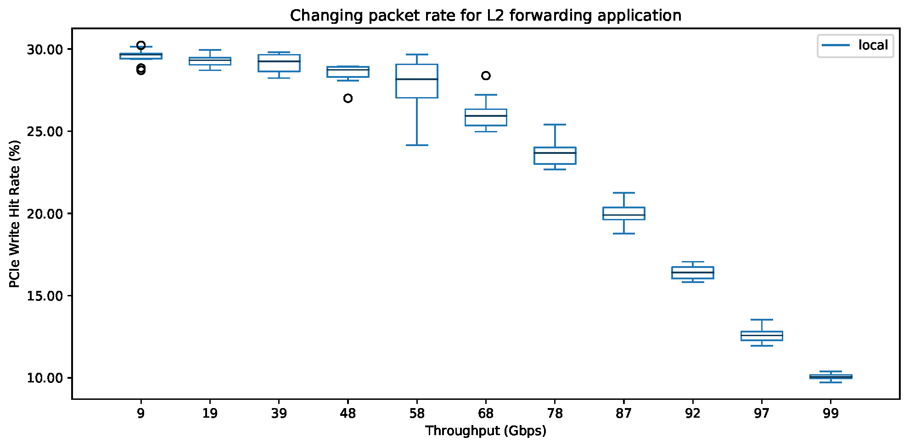

# Packet Rate Experiment

This experiment reproduces the results presented in Section 5.2 of [our paper][ddio-atc-paper]. The goal is to measure the performance of DDIO (i.e., PCIe read/write hit rate) while forwarding packets at different rates. We use fastclick's `ReplayUnqueue` to change the rate of the packet generator, see [here][replay-unqueue-page].

Unfortunately, it is not possible to generate+transfer packets at very low and very high rates within one pipeline. Therefore, we generate low-rate `pcap` files for different packet sizes and then replay them at different rates.

`make generate` create a pcap file for 1500-B packets. Afterwards, you can use `make run` to run the experiments. NPF automatically generates the output as CSVs and PDFs.

**Note that you should tune `REPLAY_TIMING` variable if you are generating/using a different pcap file.**

The output of the experiment should be similar to the following figure:

[ddio-atc-paper]: https://people.kth.se/~farshin/documents/ddio-atc20.pdf
[replay-unqueue-page]: https://github.com/tbarbette/fastclick/blob/5e06e1884c0d35bdb634858e6b1704ed8bf6faa0/elements/analysis/replay.cc
