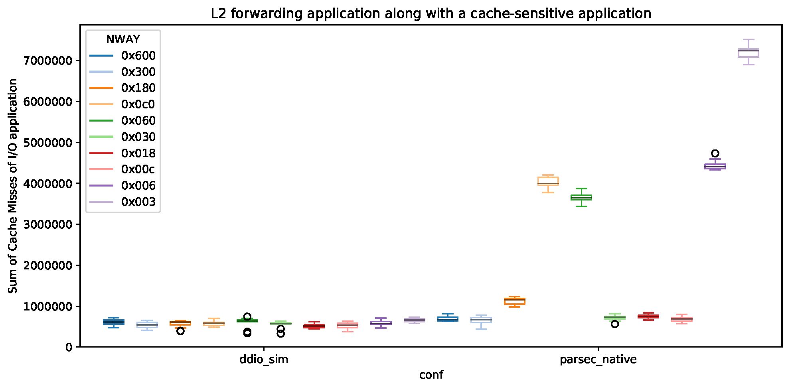

# Splash Experiments

This experiment reproduces the results presented in Section 4.1 and 4.2 of [our paper][ddio-atc-paper]. The goal is to measure the contention between an I/O application (i.e., L2 forwarding) and a cache-hungry application (i.e., water-nsquared) in the LLC.

`make run` runs these experiments. NPF automatically generates the output as CSVs and PDFs.

The output of the experiment should be similar to the following figure (i.e., `splash-results-LLCMISSES-sum-C2.pdf`):

This figure is showing the cache misses of the I/O application in two different scenarios.

- ddio_sim: When cache-hungry application uses a light-weight configuration.
- parsec_native: When cache-hungry application uses a heavy-weigth configuration.

You can check the cache misses of the cache-hungry application in the same scenarios at `splash-results-LLCMISSES-sum-C0.pdf`.

The results of our testbed is located at `results/`.

[ddio-atc-paper]: https://people.kth.se/~farshin/documents/ddio-atc20.pdf
